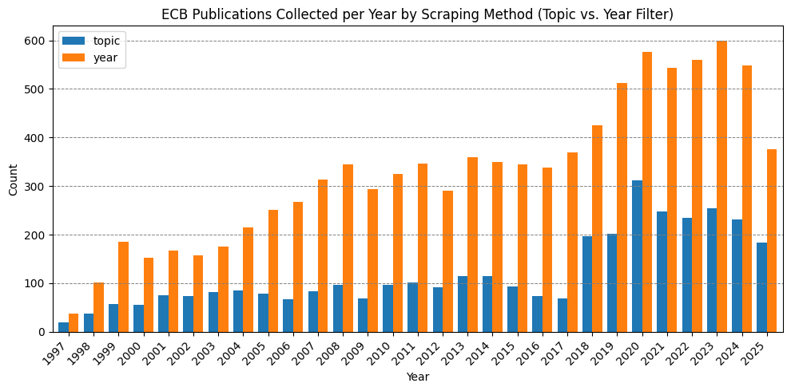
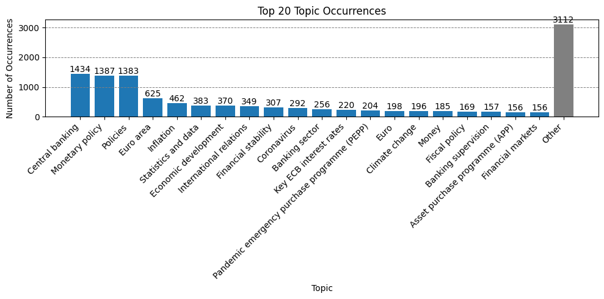
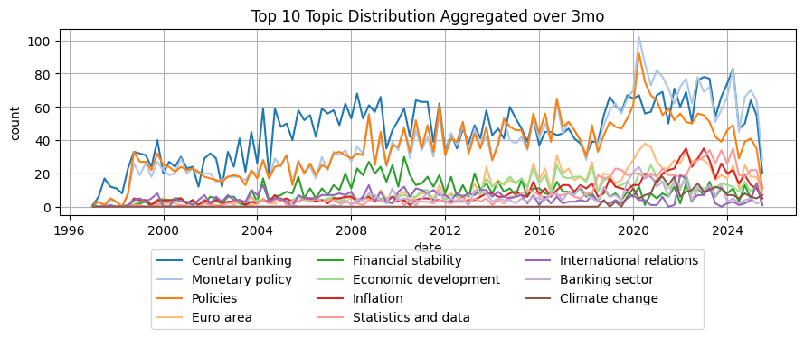
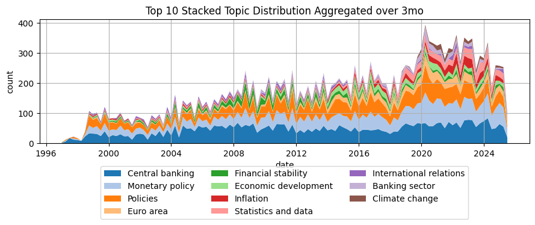
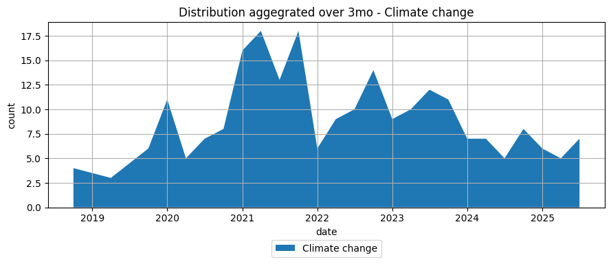
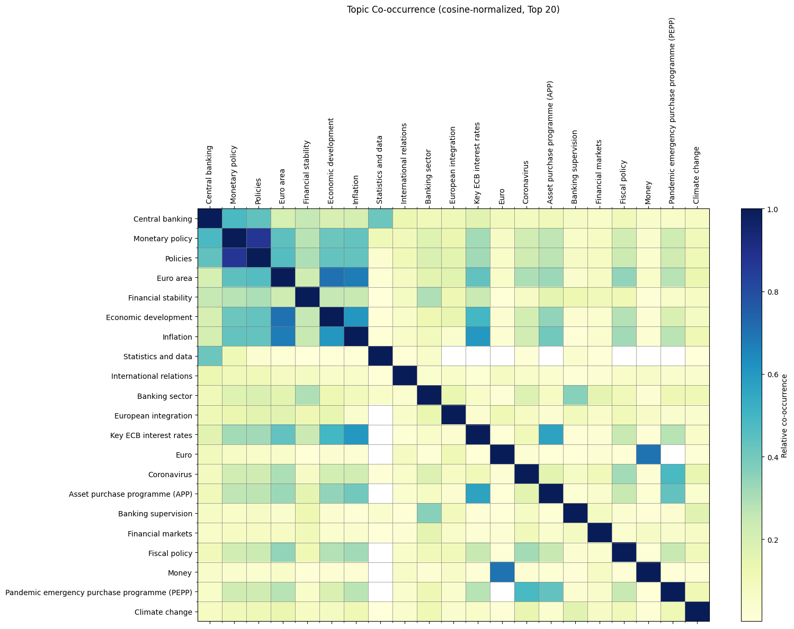
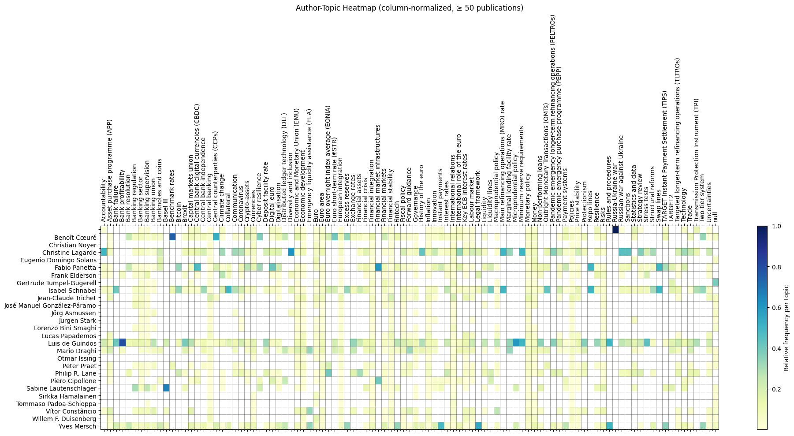
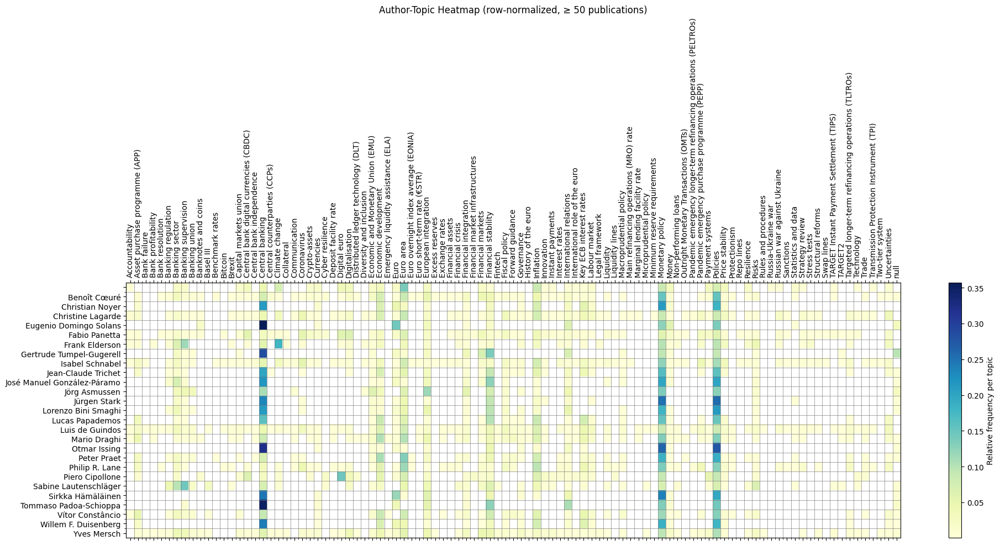
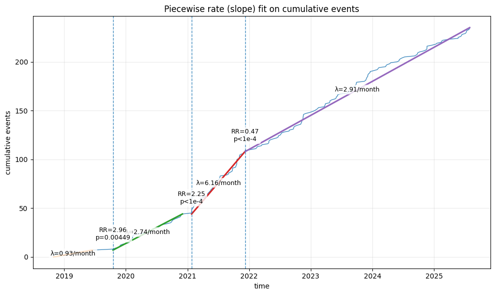

# 1. Introduction

Central bank communication is a core policy instrument. For the European Central Bank (ECB), transparent and consistent messaging underpins both its monetary policy transmission and its role as banking supervisor. The ECB explicitly frames communication as part of accountability and good governance, stressing regular engagement with stakeholders across markets, politics, academia, and civil society to contextualize economic and financial dynamics as well as broader societal developments [@ECB2025Guidelines].

Beyond market signaling, communication serves to anchor expectations, reduce uncertainty, and facilitate policy effectiveness. As the ECB has broadened its outreach, e.g. blogs, explainer pages, and social channels, its audience extends well beyond financial specialists. This diversification raises a substantive empirical question: how and when does the thematic focus of ECB communication shift, particularly around salient policy domains such as climate and the environment?

Prior work has analyzed the content of central-bank speeches, press conferences, and policy accounts, often using Latent Dirichlet Allocation (LDA) and related methods, and typically linking communication $\Rightarrow$ market or policy outcomes market or policy outcomes such as @FORTES2021 or @KAMINSKAS2024. In most cases the underlying corpora are restricted to official speeches and closely related formal channels rather than the ECB’s broader communication arsenal, including blogs and explainer pages. Comparatively less attention has been given to the inverse perspective, policy, social, and macro events $\Rightarrow$ communication, which is the perspective emphasized here. In particular, we study whether the prominence of climate-related themes in ECB communication exhibits structural changes over time.

Topic modeling offers a scalable way to quantify thematic structure in large, evolving text collections. However, purely unsupervised approaches can struggle with domain-faithful labeling and stable evaluation. This report therefore combines supervised and semi-supervised topic modeling with time-series change-point detection to (i) recover interpretable, policy-relevant themes and (ii) test for statistically significant shifts in climate-related communication.

To translate this motivation into concrete steps, we set the following research objectives: first we construct a comprehensive corpus of ECB communication (press releases, blogs, speeches) with maximal temporal coverage and rich metadata, secondly we recover and validate topic structure using both unsupervised (BERTopic-style) and supervised (multilabel) methods, with an emphasis on policy-relevant labels such as climate/environment, third we quantify the temporal dynamics of climate-related communication and detect structural breaks using statistically principled change-point methods and fourth we compare modeling choices, compraing embedding backends, supervised versus unsupervised with post-hoc mapping, and validation-time threshold calibration, with respect to predictive performance and interpretability.

To make these aims precise, we address the following research questions: 

* RQ1: What are the dominant topics in ECB communication across channels and authors, and how consistently can they be identified using supervised vs. unsupervised methods? 
* RQ2: How does the share of climate-related communication evolve, and do we observe statistically significant change points? 

This Interdisciplinary project contributes along four dimensions in a single, integrated workflow: we first build a scraped ECB communication dataset spanning press, blogs, and speeches, retaining ground-truth labels where available and producing model-predicted labels elsewhere to enable full-coverage analysis; we then deliver a head-to-head comparison of unsupervised BERTopic-style pipelines (with topic $\rightarrow$ label mapping) and supervised multilabel pipelines (fine-tuned XLM-RoBERTa and CatBoost on document embeddings), including validation-time threshold optimization for F1; and lastly we quantify temporal structure in climate-related communication via a CUSUM/Galeano-style change-point analysis that yields dated structural breaks suitable for policy interpretation.

Finally, regarding scope and interpretive stance, our empirical focus is on communication dynamics: what changes, and when. We refrain from causal attribution of the detected breaks, and the qualitative interpretation of potential drivers (policy decisions, exogenous shocks, institutional initiatives) is left to the reader and to future work that integrates external event data. The full code and reproducible pipeline will also be accessible via the GitHub repository `https://github.com/Habenzu/ECB_Topic_Chronicles.git`. 

# 2. Related Work

We cover three strands: ECB communication (with emphasis on climate), topic modeling for policy text, and change-point detection for communication time series. Methods are only sketched; implementation details follow later.

## ECB communication and climate

The ECB treats communication as a policy tool for accountability, transparency, and policy transmission, with guidance that prioritizes timely, multi-channel outreach to specialist and general audiences alike [@ECB2025Guidelines; @IMF2022CentralBankCommunications]. Existing empirical work typically analyzes formal outputs (speeches, press conferences, accounts) and links content or tone to market variables. Our focus differs: we treat communication itself as the object of measurement and ask when its thematic structure, in particular climate-related content, shows discrete shifts. This motivates assembling a multi-channel corpus (press, blogs, speeches) and testing for structural changes in climate salience over time, in line with the ECB’s own multi-audience guidance [@ECB2025Guidelines; @IMF2022CentralBankCommunications].

## Topic modeling for policy text

For cross-channel, multilingual policy text, embedding-based pipelines coupled with clustering have become standard. BERTopic operationalizes this approach and uses class-TF-IDF to produce compact descriptors, which is practical for policy analysis at scale [@GROOTENDORST2022]. However, automated coherence can diverge from human judgments of interpretability, so relying on coherence alone is risky for label-faithful topics [@CHANG2009]. To obtain policy-aligned labels at scale, we use supervised pipelines on top of embeddings: a strong tabular learner (CatBoost) and a fine-tuned multilingual transformer (XLM-RoBERTa) for multilabel prediction [@PROKHORENKOVA2018; @CONNEAU2020]. This combination yields interpretable topic signals with explicit performance guarantees on held-out data.

## Change-point detection for communication time series

Research on structural breaks in temporal data has produced a wide range of statistical techniques. Offline change point methods provide the general framework for detecting distributional shifts in sequential observations. A common approach is cumulative sum (CUSUM) testing, which evaluates deviations from a constant-rate or stable-mean benchmark and has been widely applied in event data analysis [@GALEANO2007]. Alternative approaches include mean-shift segmentation, such as the Pruned Exact Linear Time (PELT) algorithm [@KILLICK2012], and nonparametric distributional methods, such as e-divisive [@MATTESON2013]. These methods differ in their assumptions: while CUSUM is tailored to event counts and rates, PELT emphasizes shifts in mean levels, and e-divisive targets broader distributional changes. In this project, we adopt a CUSUM-style test as our primary detection method, motivated by its suitability for event-time data and interpretability in identifying structural breaks in ECB communication. We complement this with a binary segmentation procedure to efficiently locate multiple breakpoints. This combination allows for a sensitive yet theoretically grounded analysis of change points in topic-related event series.

# 3. Data Collection & Preprocessing

In this chapter we describe the data collection and preprocessing pipelines used in the project, highlight how they differ from previous research, and discuss challenges encountered during implementation.

In the first project iteration, we focused on unsupervised learning using an existing dataset published on Kaggle [@LOFARO2019]. This dataset, updated weekly by its creator, contained all available ECB speeches. While initial experiments with unsupervised learning confirmed that latent topics could be detected, we concluded that relying solely on unsupervised metrics was insufficient for thorough evaluation. Because qualitative evaluation of large datasets is highly time-consuming, we developed a dedicated scraper to collect our own corpus.

Our scraper targeted the ECB’s official publication archive (<https://www.ecb.europa.eu/press/pubbydate/html/index.en.html>), which contains material dating back to 1997. Parts of this archive are already categorized by topic. However, when scraping via the `topic` filter, only about 36% of the ~10,000 available publications could be retrieved due to the site’s continuous scroll setup. Switching to the `year` filter enabled us to collect all publications, with 36% of them already labeled by the ECB. We then deduplicated entries, aggregated topics (since a single publication may be linked to multiple topics), and parsed the downloaded HTML with a custom parser. The page structure also allowed us to extract various metadata, which later proved valuable in the analysis.  

The figure below illustrates the yearly distribution of collected publications by scraping method (topic vs. year filter).

The final raw dataset consists of 9,525 publications, of which 3,494 carry ECB-assigned labels across 102 distinct topics. For each entry we collected the following fields:

- `date`: publication date  
- `category`: ECB-assigned category (e.g., Governing Council statement, Research Bulletin, Speech)  
- `title`: title of the publication  
- `filter_type`: filter used during scraping (`year` or `topic`)  
- `filter_value`: corresponding filter value (year or topic)  
- `url`: source URL of the HTML file  
- `authors`: list of authors  
- `text`: parsed text from the HTML  

The complete scraping pipeline is implemented in the repository file `all_new_publication_scraper.py`.

In the preprocessing stage, we removed rows unsuited for analysis (e.g., empty texts or files available only as PDFs). The labeled data was split into training (70%), validation (15%), and test (15%) sets. Depending on the context window of the embedding models, we applied token-based chunking and embedded the resulting text chunks.

Three embedding models were used: OpenAI’s proprietary `text-embedding-3-large`, and two open-source models from the `sentence-transformers` library: `all-MiniLM-L12-v2` and `all-mpnet-base-v2`. This choice allowed us to compare open-source and closed-source backends, as well as investigate the role of context window size in downstream performance. OpenAI’s model is widely adopted in practical applications, whereas the two `sentence-transformers` models represent top-performing, easily accessible general-purpose alternatives.

With these prepared embeddings, we then proceeded to train the supervised and unsupervised models, which are described in the following chapter.

# 4. Methodology

In this chapter, we first describe the final training pipelines, outlining the architectures and approaches used to identify the best-performing model. This model was then applied to label the previously unlabeled 64% of the dataset. Afterwards, we briefly discuss the applied change point detection method.

## Supervised and Unsupervised Training

As noted earlier, we trained multiple supervised and unsupervised models with different backends. The goal was to benchmark and determine the most effective approach for topic modeling on this dataset.

### Unsupervised

We trained three unsupervised BERTopic models with the embedding backends `text-embedding-3-large`, `all-MiniLM-L12-v2`, and `all-mpnet-base-v2`. We focused exclusively on embedding-based approaches since prior research has shown that BERTopic, due to its transformer-based architecture, generally outperforms more classical methods. Additionally, this architecture reduces the need for extensive preprocessing steps such as tokenization or stemming. In BERTopic, documents are first embedded into high-dimensional word vectors, which are then reduced in dimensionality and clustered into topics. The BERTopic pipeline is modular, consisting of five sequential components, with BERT as the default embedding backend, although each component can be replaced by alternative methods.

\begin{figure}[ht]
\centering
\begin{tikzpicture}[node distance=2.8cm, every node/.style={font=\small}]
  % Styles
  \tikzstyle{method} = [rectangle, minimum width=2cm, minimum height=1cm, text centered, draw=black, fill=blue!60, text=white]
  \tikzstyle{arrow} = [thick,->,>=stealth]
  \tikzstyle{caption} = [below, align=center]

  % Nodes
  \node (bert)   [method] {BERT};
  \node (umap)   [method, right of=bert] {UMAP};
  \node (hdbscan) [method, right of=umap] {HDBSCAN};
  \node (ctfidf) [method, right of=hdbscan, fill=gray!60] {C-TFIDF};
  \node (mmr)    [method, right of=ctfidf] {MMR};
  \node (mapping)    [method, right of=mmr, fill=red!60] {Mapping};

  % Arrows
  \draw [arrow] (bert) -- (umap);
  \draw [arrow] (umap) -- (hdbscan);
  \draw [arrow] (hdbscan) -- (ctfidf);
  \draw [arrow] (ctfidf) -- (mmr);
  \draw [arrow] (mmr) -- (mapping);

  % Captions
  \node [caption] at (bert.south)   {Word\\embedding};
  \node [caption] at (umap.south)   {Dimensionality\\reduction for\\word embedding};
  \node [caption] at (hdbscan.south){Cluster into\\Topics};
  \node [caption] at (ctfidf.south) {Word\\representation\\for topics};
  \node [caption] at (mmr.south)    {Fine-tune\\the word\\representation for\\topics};
  \node [caption] at (mapping.south)    {Supervised\\Label Mapping\\via Ridge\\Regression};
\end{tikzpicture}
\caption{Overview of the BERTopic pipeline (blue: default, red: additional components, gray: theoretically optional component).}
\label{fig:bertopic_flowchart}
\end{figure}

In our setup, we extended the pipeline by including the OpenAI transformer embedding model alongside the two BERT-based backends and by introducing a mapping step after the MMR stage. We also restricted the number of clusters to 102, equal to the number of supervised dataset topics, which is necessary for the mapping to function.

The process begins by embedding documents into latent vector spaces created by the transformer-based models (OpenAI embeddings and BERT-based embeddings, which share similar architectures). Dense representations are generated through tokenization, embedding, and multiple transformer layers consisting of self-attention, feedforward networks, and normalization. This produces contextualized embeddings that capture nuanced semantic information [@JURAFSKY2025].

Subsequently, BERTopic applies Uniform Manifold Approximation and Projection (UMAP) to reduce dimensionality while preserving local and global structures. UMAP constructs a nearest-neighbor graph in the original space and optimizes a low-dimensional embedding that maintains neighborhood relations. We set parameters to `n_neighbors=15`, `n_components=5`, `min_dist=0.0`, and `metric='cosine'` [@UMAP2020; @KUO2023].

The reduced embeddings are then clustered using Hierarchical Density-Based Spatial Clustering of Applications with Noise (HDBSCAN), a density-based algorithm capable of identifying clusters of varying shapes and sizes without requiring a predefined number of clusters. We used `min_cluster_size=15` (`=5` for `text-embedding-3-large` to avoid overly small cluster counts), `min_samples=1`, `metric='cosine'`, `cluster_selection_method='eom'`, and `prediction_data=True` [@HDBSCAN2013; @KUO2023].

While BERTopic typically generates topic representations after clustering, in our approach this step is retained but not essential, since we later map predicted unsupervised topic IDs to ground-truth topics via the validation set. Because documents were chunked to fit model context windows, multiple predictions per document are aggregated into histogram vectors:

$$
h_d = \frac{1}{\sum_{j=1}^K \sum_{c=1}^{C_d} \mathbf{1}\{t_{d,c}=j\}}
\;\Big(\,\sum_{c=1}^{C_d} \mathbf{1}\{t_{d,c}=1\}, \dots,
\sum_{c=1}^{C_d} \mathbf{1}\{t_{d,c}=K\}\Big).
$$

Here, $d$ denotes the document index, $C_d$ the number of chunks, $K$ the number of topics (102), and $t_{d,c}$ the predicted topic ID for chunk $c$ in document $d$. A non-negative ridge regression then learns mappings from topic histograms to labels:

$$
w_l = \arg\min_{w \ge 0} \;
\| y_l - T_{train} w \|_2^2
+ \alpha \| w \|_2^2.
$$

This produces a mapping matrix $W \in R^{K \times L}$ ensuring interpretability by restricting weights to non-negative contributions. Validation scores are calibrated with label-specific thresholds $\tau_l$ maximizing F1, and final predictions apply these calibrated thresholds. This procedure yields interpretable mappings from topics to labels, enabling comparison of unsupervised clusters with supervised topics.

### Supervised

The first supervised models followed the BERTopic approach conceptually but replaced clustering with boosted random forests trained on embeddings. We used the `CatBoost` framework, which performs well on tabular data [@SHMUEL2024] and requires minimal preprocessing. Out-of-the-box settings were adopted for simplicity.

\begin{figure}[ht]
\centering
\begin{tikzpicture}[node distance=2.8cm, every node/.style={font=\small}]
  % Styles
  \tikzstyle{method} = [rectangle, minimum width=2cm, minimum height=1cm, text centered, draw=black, fill=blue!60, text=white]
  \tikzstyle{arrow} = [thick,->,>=stealth]
  \tikzstyle{caption} = [below, align=center]

  % Nodes
  \node (bert)   [method] {BERT};
  \node (catboost)   [method, right of=bert] {CatBoost};
  \node (trshld) [method, right of=catboost] {Threshold Tuning};
  \node (ctfidf) [method, right of=trshld, fill=gray!60] {C-TFIDF};

  % Arrows
  \draw [arrow] (bert) -- (catboost);
  \draw [arrow] (catboost) -- (trshld);
  \draw [arrow] (trshld) -- (ctfidf);

  % Captions
  \node [caption] at (bert.south)   {Word\\embedding};
  \node [caption] at (catboost.south)   {CatBoost\\OneVsRestClassifier\\Model};
  \node [caption] at (trshld.south) {Threshold\\tuning on\\Validation};
  \node [caption] at (ctfidf.south) {Word\\representation\\for topics};
\end{tikzpicture}
\caption{Supervised learning pipeline aligned with BERTopic (gray: optional component).}
\label{fig:SupervisedCatBoost_flowchart}
\end{figure}

CatBoost builds ensembles of symmetric trees sequentially, each correcting errors of its predecessor [@CATBOOST2019]. Since the classifier predicts one label at a time, we wrapped it in a `OneVsRestClassifier` to enable multi-label outputs. Predictions across chunks of a document were aggregated at document level by taking the maximum score per label. Thresholds were tuned on the validation set to maximize F1. A BERTopic-style word representation step was optionally implemented for exploratory purposes.

The second supervised setup used a transformer-based architecture fine-tuned for multi-label classification with the `xlm-roberta-base` backbone, predicting 102 labels. Mean pooling was applied to token embeddings, with dropout 0.2 for regularization. Long documents were chunked into overlapping 512-token segments (stride 64), with predictions aggregated via maximum scores. Training ran for 8 epochs with batch size 8, learning rate 2e-5, weight decay 0.01, and linear warm-up over 6% of optimization steps.

For multi-label classification, we used `BCEWithLogitsLoss`, combining sigmoid activation with binary cross-entropy in a stable formulation [@FALLAH2022]. This models label presence independently and allows robust probability estimation.

### Evaluation of Topic Modelling Approaches

To compare models, we report both per-document and per-label metrics. Example-based metrics (precision, recall, F1, Jaccard similarity) assess overlap between predicted and true label sets, with subset accuracy requiring exact matches. Hamming loss measures average label-wise errors. Micro-averaged metrics emphasize frequent labels, macro-averaged metrics treat all labels equally, and macro balanced accuracy accounts for imbalance. Weighted metrics balance the two extremes. Together, these provide a comprehensive view of model quality. Comparisons were conducted on the 15% test set (525 documents across 102 topics).

### Change Point Detection

After training and evaluation, the best-performing model was used to label the unlabeled dataset, expanding topic coverage. These predicted topics were then aggregated into temporal event data (counts and percentages at daily, weekly, or monthly intervals). Data were aligned by filling missing periods with zeros, ensuring continuity. Event timestamps were reconstructed by evenly distributing counts within intervals, enabling time-based change detection.

We applied a CUSUM-based test adapted from @GALEANO2007 to detect deviations from uniform event distributions, indicative of structural breaks. Critical values were estimated using Monte Carlo simulations to control type I error. Change points were identified via binary segmentation, recursively partitioning the timeline at significant deviations while maintaining family-wise error control. This nonparametric method enables sensitive, interpretable detection of shifts in event dynamics. Visualization of CUSUM deviations further supports interpretability. The pipeline thus combines temporal aggregation, event reconstruction, and robust statistical testing to analyze structural changes in topic-related dynamics [@KILLICK2012].

# 5. Results

In this chapter, we compare the different modeling approaches, identify the best-performing model to use for change point detection, and address the research questions accordingly.

## Topic Modelling

As previously noted, we trained two families of models (unsupervised and supervised) and evaluated each on example-based and weighted metrics.

\begin{table}[htbp]
\centering
\caption{Performance comparison of models for multi-label topic prediction. For each metric, the best result is highlighted in green and the second-best in blue. The prefix "usv" refers to unsupervised BERTopic pipelines, whereas "cb" denotes CatBoost-based models.}
\resizebox{\textwidth}{!}{%
\begin{tabular}{lccccccc}
\toprule
metric & \shortstack{usv-text-\\embedding-3-large} & \shortstack{usv-all-\\mpnet-base-v2} & \shortstack{usv-all-\\MiniLM-L12-v2} & \shortstack{cb-text-\\embedding-3-large} & \shortstack{cb-all-\\MiniLM-L12-v2} & \shortstack{cb-all-\\mpnet-base-v2} & \shortstack{finetuned-\\xlm-roberta-base} \\
\midrule
n-labels & 102 & 102 & 102 & 102 & 102 & 102 & 102 \\
n-samples & 525 & 525 & 525 & 525 & 525 & 525 & 525 \\
example-f1 & 0.491 & 0.523 & 0.473 & \textbf{\cellcolor{green!20}{0.726}} & 0.486 & 0.643 & \textbf{\cellcolor{blue!20}{0.654}} \\
example-precision & 0.449 & 0.503 & 0.393 & \textbf{\cellcolor{green!20}{0.748}} & 0.381 & 0.575 & \textbf{\cellcolor{blue!20}{0.670}} \\
example-recall & 0.674 & 0.684 & 0.759 & 0.765 & \textbf{\cellcolor{green!20}{0.947}} & \textbf{\cellcolor{blue!20}{0.881}} & 0.711 \\
hamming-loss & 0.054 & 0.045 & 0.060 & \textbf{\cellcolor{green!20}{0.019}} & 0.099 & 0.046 & \textbf{\cellcolor{blue!20}{0.029}} \\
jaccard & 0.397 & 0.430 & 0.364 & \textbf{\cellcolor{green!20}{0.653}} & 0.375 & 0.548 & \textbf{\cellcolor{blue!20}{0.581}} \\
macro-balanced-accuracy & 0.622 & 0.673 & 0.672 & 0.648 & \textbf{\cellcolor{green!20}{0.768}} & \textbf{\cellcolor{blue!20}{0.734}} & 0.692 \\
macro-f1 & 0.226 & 0.254 & 0.251 & \textbf{\cellcolor{blue!20}{0.329}} & 0.247 & 0.309 & \textbf{\cellcolor{green!20}{0.330}} \\
macro-precision & 0.241 & 0.246 & 0.221 & \textbf{\cellcolor{green!20}{0.397}} & 0.177 & 0.244 & \textbf{\cellcolor{blue!20}{0.357}} \\
macro-recall & 0.289 & 0.382 & 0.400 & 0.306 & \textbf{\cellcolor{green!20}{0.644}} & \textbf{\cellcolor{blue!20}{0.516}} & 0.404 \\
micro-f1 & 0.403 & 0.466 & 0.425 & \textbf{\cellcolor{green!20}{0.699}} & 0.383 & 0.551 & \textbf{\cellcolor{blue!20}{0.601}} \\
micro-precision & 0.317 & 0.382 & 0.310 & \textbf{\cellcolor{green!20}{0.722}} & 0.241 & 0.404 & \textbf{\cellcolor{blue!20}{0.548}} \\
micro-recall & 0.553 & 0.598 & 0.679 & 0.677 & \textbf{\cellcolor{green!20}{0.939}} & \textbf{\cellcolor{blue!20}{0.864}} & 0.665 \\
subset-accuracy & 0.177 & 0.200 & 0.116 & \textbf{\cellcolor{green!20}{0.419}} & 0.130 & 0.307 & \textbf{\cellcolor{blue!20}{0.370}} \\
weighted-f1 & 0.480 & 0.536 & 0.566 & \textbf{\cellcolor{green!20}{0.668}} & 0.491 & 0.599 & \textbf{\cellcolor{blue!20}{0.632}} \\
weighted-precision & 0.487 & 0.540 & 0.520 & \textbf{\cellcolor{green!20}{0.690}} & 0.353 & 0.478 & \textbf{\cellcolor{blue!20}{0.641}} \\
weighted-recall & 0.553 & 0.598 & 0.679 & 0.677 & \textbf{\cellcolor{green!20}{0.939}} & \textbf{\cellcolor{blue!20}{0.864}} & 0.665 \\
\bottomrule
\end{tabular}}
\end{table}

From these metrics, it is clear, and not surprising, that directly supervised modeling (rather than via an unsupervised pipeline) outperforms the unsupervised approach. Overall, the CatBoost model based on the `text-embedding-3-large` embeddings performs best on most metrics. A close second is the fine-tuned `xlm-roberta-base` model, which also performs strongly across many metrics; however, similar to `cb-text-embedding-3-large`, it exhibits comparatively low recall.

For the unsupervised BERTopic variants, the results highlight the importance of smaller chunks. Because we created chunks as large as possible, `text-embedding-3-large` produced relatively few chunks; combined with the fact that BERTopic does not intrinsically support multi-label topics, performance is lower than with embedding models that have a smaller context window.

We therefore conclude that the large embeddings from `text-embedding-3-large` (3072) carry substantial signal for predicting document topics. At the same time, the (two-times larger than 384) 768-dimensional embeddings of `all-mpnet-base-v2` are, based on this evaluation, not more informative than the 384-dimensional `all-MiniLM-L12-v2` embeddings.

We also observe that fine-tuning a pretrained model such as `xlm-roberta-base`, while not performing poorly, may not be worth the computational effort in some settings, as fine-tuning required significantly more time than the CatBoost alternatives.

Per-topic performance exhibits similar trends across models: some topics are consistently easier (or harder) to predict, with absolute levels shifting by model. The figure below illustrates test-set performance for the CatBoost-based approaches. The `text-embedding-3-large` backend almost uniformly outperforms the other embedding backends and, which is particularly relevant for our use case, shows very strong performance on the topic "Climate Change".

## Topic Distributions

After labeling the previously unlabeled dataset, we analyze topic distributions over time, author preferences, and category-level distributions.

First, considering overall topic dynamics, the total number of publications clearly increases over time, with a substantial rise around 2018/2019 followed by a slight decline. The dominant topic "Central banking" acts as a relatively stable baseline with modest fluctuations, even as other topics trend upward or downward. Topic diversity grows as well: in the early 2000s, "Central Banking," "Monetary Policy," and "Policies" dominate by a wide margin.

Focusing on "Climate Change," the first appearance occurs in October 2018 with the speech "Ten years after the crisis – risks, rules and supervision" by Sabine Lautenschläger. Subsequent climate-related publications increase markedly, peaking at the end of the first quarter of 2021, followed by a slight downward trend that nonetheless remains at a medium-high level.

Because each publication may carry multiple topics, it is natural to examine co-occurrence. Rather than raw counts, we use a cosine-normalized measure that reflects how often two topics co-appear while neutralizing popularity:

$$
\mathrm{cos}(i,j) \;=\; \frac{\#\{\text{docs with both } i \text{ and } j\}}{\sqrt{(\#\{\text{docs with } i\}) \cdot (\#\{\text{docs with } j\})}}.
$$

We observe, for example, a co-occurrence cluster among the dominant topics "Central banking," "Monetary Policies," and "Policies," with an additional cluster linking "Monetary Policies" and "Policies" to "Economic development" and "Inflation." Other intuitive pairings include "Inflation" with "Key ECB interest rates," and "Money" with "Euro." Notably, "Climate change" does not form a distinct, tight cluster; this suggests it may act as a background topic that co-occurs broadly across others.

We also examine how individual authors shape topics. For instance, Benoît Cœuré is a leading contributor to "Benchmark rates," while also contributing substantially to "Policies" and "Euro area." Consistent with earlier findings, "Climate change" appears to be driven by multiple authors; Christine Lagarde and Frank Elderson are among the principal contributors, though neither confines their publications to this topic.

In summary, topic prevalence evolves meaningfully over time. Some topics maintain a steady baseline, while others emerge and recede. "Climate change" is among the latter, becoming visible in 2018 and growing in importance thereafter. Moreover, few authors specialize in a single topic; instead, topics are shaped collectively, even when authors do not coauthor individual publications.

## Change Point Detection

We now investigate whether the distributional patterns observed above can be validated statistically. Specifically, we test for statistically significant changepoints and their timing.

We model the sequence of publication times mentioning "Climate change" as a piecewise-constant Poisson process. Under the null hypothesis of a constant rate $\lambda$ (no changepoint), inter-arrival times are i.i.d. exponential and, conditional on the total observation window, the ordered arrivals behave like order statistics of a Uniform$(0,1)$ sample. Following @GALEANO2007, we test deviations from this null using a CUSUM-type statistic on the rescaled event times.

Let $0 < T_1 < \dots < T_n = T$ denote arrival times (in days) since the first observed event (first publication on "Climate change"). Define rescaled times $U_i = T_i / T$ and CUSUM deviations
$$
D_i \;=\; \sqrt{n}\, \Big(U_i - \frac{i}{n}\Big), \qquad i=1,\dots,n .
$$

Under the null (homogeneous Poisson), $\{D_i\}$ converges to a Brownian bridge, and the test statistic
$$
\Lambda_{\max} \;=\; \max_{1\le i\le n} | D_i |
$$
has a known null distribution that we approximate via Monte Carlo. We reject "no change" if $\Lambda_{\max} > c_{1-\alpha}(n)$, where $c_{1-\alpha}(n)$ is the simulated critical value at level $\alpha$.

To locate a change, we take $\hat{\tau} = \arg\max_i \lvert D_i \rvert$ as the estimated changepoint. Multiple changepoints are obtained by binary segmentation: split at $\hat{\tau}$, recurse on the left/right segments, and control family-wise error by progressively tightening the per-split level (Bonferroni-style).

Between detected changepoints we assume a constant rate. The slope of the expected cumulative count within a segment equals the Poisson rate,

$$
\hat{\lambda}_s \;=\; \frac{\#\text{events in segment } s}{\text{exposure time in days}} ,
$$
which we display as a piecewise-linear fit to the empirical cumulative events. A kink (with significant $\Lambda_{\max}$) indicates a change in frequency. The effect size at a changepoint is the rate ratio
$$
\text{RR} \;=\; \frac{\hat{\lambda}_{\text{after}}}{\hat{\lambda}_{\text{before}}},
$$
with $\text{RR}>1$ indicating an increase. For direction and magnitude, we test adjacent segments using a Poisson two-sample rate test, reporting RR and a p-value.

The figure shows three statistically significant changepoints that split the series into four regimes: at index 7 (17 Oct 2019), index 44 (25 Jan 2021), and index 108 (08 Dec 2021). In the first three regimes, the estimated arrival rate of "Climate change" publications increases at each break ($\text{RR} > 1$), indicating progressively higher publication frequency. At the third changepoint (index 108), the rate ratio falls below 1, implying a significant decline in the publication rate relative to the preceding regime.

# 6. Conclusion and Outlook

This Interdisciplinary project we set out to measure what the ECB communicates with an emphasis on climate, and to identify when its focus shifts by integrating a custom data pipeline, topic labeling, and statistically principled change point detection. Across roughly 9.5 thousand publications that span speeches, blogs, and press material, supervised approaches yielded the most consistent and policy aligned topics. A CatBoost one versus rest classifier trained on text-embedding-3-large embeddings achieved the strongest overall performance across example based and label wise metrics, with a fine tuned XLM-RoBERTa close behind. Unsupervised BERTopic pipelines were informative but lagged on strict multi label criteria, reflecting the difficulty of aligning clusters to a fixed policy taxonomy. Per topic analyses further showed stable recognition of the Climate change label. Co occurrence patterns suggest that climate behaves as a cross cutting theme rather than forming a narrow cluster, which fits its diffusion across policy areas.

The temporal profile of climate related communication is clear. The first appearance in our corpus occurs in October 2018, followed by a rapid expansion that peaks around late Q1 2021 and then moderates. A CUSUM or Galeano style event time analysis isolates three statistically significant structural breaks dated 17 Oct 2019, 25 Jan 2021, and 08 Dec 2021. The first two breaks correspond to increases in the arrival rate of climate related publications, the third to a decrease relative to the immediately preceding regime. These dates should be read as descriptive markers in the communication record rather than as causal attributions.

Methodologically, the project contributes a multi channel ECB corpus with rich metadata and partial native labels, a head to head comparison of unsupervised pipelines with post hoc label mapping versus supervised pipelines on identical splits and metrics, and an event oriented change point workflow with Monte Carlo calibrated critical values and binary segmentation under family wise error control. The pipeline scales to the unlabeled majority of the corpus and preserves reproducibility for downstream time series analysis.

Several limitations remain. Only about 36 percent of items carried native ECB topic tags, so model predictions populate the remainder and may introduce residual mislabeling even after per label F1 threshold calibration. Document level scores aggregate chunk level predictions by a max operator, which may overweight localized mentions and underweight diffuse ones. Post hoc alignment for unsupervised clusters can drift when cluster structure changes over time. Most importantly, the detection of structural breaks provides timestamps, not explanations, and causal interpretation requires external event data, furthermore the what could be done in future research is to test for correlation with other topics which could be an explanation for a lower number of publications in one topic.

The implications are practical. Climate appears as an evolving cross theme within ECB outreach, not a niche confined to a single channel or author. The dated breaks offer anchors for qualitative follow up and for market side event studies that condition on communication regimes. The pipeline can be extended to analyze channel specific or author specific dynamics, and it can incorporate sentiment or framing to capture how climate is discussed, not only how often.

Future work should link the detected breaks to a curated timeline of ECB policy actions, EU initiatives, and salient macro shocks, and should test channel and author heterogeneity explicitly. Human evaluation on a stratified sample would help assess topic faithfulness and boundary cases, complementing automated metrics. Finally, porting the workflow to other central banks would allow comparative analysis of institutional heterogeneity and the diffusion of climate discourse across the Eurosystem and beyond.

In sum, a reproducible, measurement first approach that pairs supervised topic labeling on strong embeddings with event time change point detection yields interpretable themes and dated structural breaks in ECB communication. This provides a transparent foundation for subsequent causal and comparative work on how central banks speak about climate and how that speech evolves over time.
\newpage